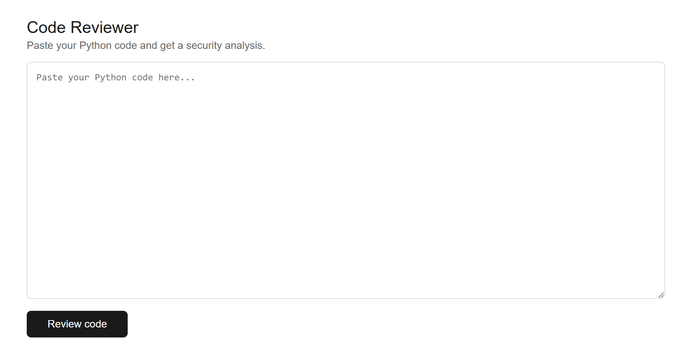

# Code security reviewer 🛡️

AI-powered code security reviewer built with FastAPI - static analysis + LLM feedback. <br>
**🚧 Still Under Construction**

## 🔜 Planned features 
- web app for code security analysis
- AI-powered feedback via custom code-trained LLMs
- Static analysis with Bandit (Python)
- Multi-language support (future)

## 📦 Installation

```bash
git clone https://github.com/nicowu07/code-reviewer.git
cd code-reviewer
python -m venv venv
source venv/bin/activate  # Windows: venv\Scripts\activate
pip install -r requirements.txt
```

## 🚀 Try it out
```bash
uvicorn main:app --reload
```
Open http://localhost:8000 — you'll see your app running. Paste some code, click the button, it responds.




